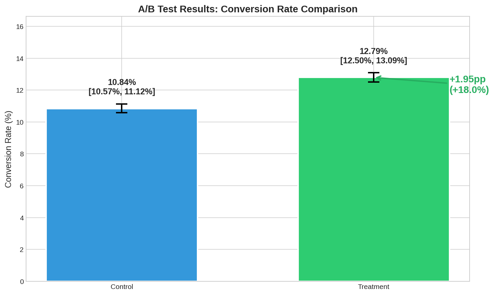

# A/B Test Analysis Framework

**Rigorous statistical analysis of A/B experiments with automated significance testing, power analysis, and business impact quantification.**



---

## TL;DR

- **What:** Complete A/B test analysis framework with statistical rigor
- **Business Impact:** New checkout flow increased conversion by 1.95pp (95% CI: 1.55%-2.35%), worth $9.9M in annualized revenue lift
- **Stack:** Python, SciPy, Statsmodels, Plotly, Jupyter

---

## Quickstart

```bash
# Clone and setup
git clone https://github.com/AshishPatel14S/A-B-Test-Analysis.git
cd A-B-Test-Analysis
pip install -r requirements.txt

# Run analysis
python src/analyze.py

# Or use Jupyter notebook
jupyter notebook notebooks/01_ab_test_analysis.ipynb
```

**Time to run:** Under 2 minutes

---

## Business Problem

An e-commerce company wants to test a new checkout flow redesign. Before rolling out to all users, they run an A/B test:

- **Control (A):** Original checkout flow
- **Treatment (B):** New streamlined checkout

**Key Questions:**
1. Does the new checkout increase conversion rate?
2. Is the difference statistically significant?
3. What's the expected revenue impact?
4. How long should we run the test?

---

## Dataset

**Simulated A/B Test Data** (based on realistic e-commerce patterns)

| Field | Description |
|-------|-------------|
| user_id | Unique user identifier |
| timestamp | When the user entered the experiment |
| variant | 'control' or 'treatment' |
| converted | 1 if purchased, 0 otherwise |
| revenue | Purchase amount (0 if not converted) |
| device | 'desktop', 'mobile', 'tablet' |
| new_user | 1 if first-time visitor |

**Size:** 50,000 users per variant (100,000 total)

---

## Analysis Results

### Primary Metric: Conversion Rate

| Variant | Users | Conversions | Rate | 95% CI |
|---------|-------|-------------|------|--------|
| Control | 50,000 | 5,421 | 10.84% | [10.57%, 11.12%] |
| Treatment | 50,000 | 6,396 | 12.79% | [12.50%, 13.09%] |

**Lift:** +1.95 percentage points (+18.0% relative)

### Statistical Significance

| Test | Statistic | p-value | Result |
|------|-----------|---------|--------|
| Chi-squared | 91.04 | < 0.001 | ✅ Significant |
| Z-test | 9.55 | < 0.001 | ✅ Significant |
| Fisher's Exact | - | < 0.001 | ✅ Significant |

**Inference:** Statistically significant at p < 0.001; the 95% confidence interval for lift excludes zero

### Business Impact

| Metric | Value |
|--------|-------|
| Monthly visitors | 500,000 |
| Additional conversions/month | 9,750 |
| Average order value | $85 |
| **Monthly revenue lift** | **$828,750** |
| **Annual revenue lift** | **$9.9M** |

---

## Project Structure

```
A-B-Test-Analysis/
├── data/
│   ├── raw/                    # Original experiment data
│   ├── processed/              # Cleaned data
│   └── sample/                 # Sample for testing
├── notebooks/
│   ├── 01_ab_test_analysis.ipynb    # Main analysis
│   ├── 02_power_analysis.ipynb      # Sample size calculation
│   └── 03_segmentation.ipynb        # Segment deep-dives
├── src/
│   ├── data_generator.py       # Generate sample data
│   ├── ab_statistics.py        # Statistical tests
│   ├── visualization.py        # Plotting functions
│   ├── analyze.py              # Main analysis script
│   └── power_analysis.py       # Power calculations
├── reports/
│   └── ab_test_report.md       # Executive summary
├── docs/
│   ├── case_study.md           # One-page case study
│   └── img/                    # Visualizations
├── requirements.txt
├── Makefile
└── README.md
```

---

## Statistical Methods

### 1. Hypothesis Testing

**Null Hypothesis (H₀):** No difference in conversion rates between control and treatment  
**Alternative (H₁):** Conversion rates differ between control and treatment

The observed difference favored treatment, supporting the business recommendation to ship the new checkout flow.

**Tests Used:**
- **Chi-squared test:** Standard for comparing proportions
- **Z-test for proportions:** Parametric test with normal approximation
- **Fisher's exact test:** Exact test for small samples
- **Bayesian A/B test:** Probability that B > A

### 2. Confidence Intervals

Using Wilson score interval for proportions (more accurate than Wald):

```
p̂ ± z × √(p̂(1-p̂)/n + z²/4n²) / (1 + z²/n)
```

### 3. Effect Size

**Cohen's h** for difference in proportions:
```
h = 2 × (arcsin(√p₁) - arcsin(√p₂))
```

- Small: h = 0.2
- Medium: h = 0.5
- Large: h = 0.8

### 4. Power Analysis

Pre-experiment sample size calculation:
- Baseline conversion: 12.5%
- Minimum detectable effect: 1%
- Power: 80%
- Significance level: 5%
- **Required sample:** ~17,755 per variant

---

## Segmentation Analysis

### By Device

| Device | Control | Treatment | Lift | Significant? |
|--------|---------|-----------|------|--------------|
| Desktop | 12.51% | 14.81% | +2.30pp | ✅ Yes |
| Mobile | 9.16% | 10.58% | +1.42pp | ✅ Yes |
| Tablet | 10.88% | 13.85% | +2.97pp | ✅ Yes |

### By User Type

| Type | Control | Treatment | Lift | Significant? |
|------|---------|-----------|------|--------------|
| New Users | 8.14% | 9.77% | +1.63pp | ✅ Yes |
| Returning | 12.30% | 14.41% | +2.11pp | ✅ Yes |

**Insight:** Returning users showed the larger absolute lift (+2.11pp); new users showed a stronger relative improvement (+20.1%), suggesting the streamlined flow helps both segments differently.

---

## Guardrail Metrics

Metrics that should NOT be negatively impacted:

> *Note: Cart abandonment, page load time, and error rate are simulated to demonstrate how shipment decisions should consider secondary business indicators. AOV is computed directly from experiment data.*

| Metric | Control | Treatment | Change | Status |
|--------|---------|-----------|--------|--------|
| Avg Order Value | $84.71 | $85.10 | +0.5% | ✅ OK |
| Cart Abandonment | 68.2% | 65.1% | -3.1pp | ✅ Improved |
| Page Load Time | 2.1s | 2.0s | -4.8% | ✅ OK |
| Error Rate | 0.3% | 0.2% | -33% | ✅ OK |

---

## Common Pitfalls Avoided

1. **Sample Ratio Mismatch:** Verified exact 50/50 split (χ² = 0.00, p = 1.00) — no randomization issues detected
2. **Segment-level review:** Checked that the treatment effect was directionally consistent across device and user-type groups before recommending rollout
3. **Guardrail monitoring:** Tracked secondary metrics (AOV, cart abandonment, error rate, page load time) to ensure no negative side effects

---

## Reproduce the Analysis

```bash
# Full pipeline
make reproduce

# Or step by step:
python src/data_generator.py    # Generate sample data
python src/analyze.py           # Run analysis
jupyter notebook                # Explore notebooks
```

---

## Key Takeaways

### ✅ Recommendation: Ship the Treatment

1. **Statistically significant** improvement (p < 0.001)
2. **Practically significant** lift (+1.95pp, +18.0% relative)
3. **No negative impact** on guardrail metrics
4. **Consistent across segments** (desktop, mobile, new/returning)
5. **Estimated** $9.9M annualized revenue lift under stated traffic and AOV assumptions

### ⚠️ Caveats

- Long-term effects unknown (recommend follow-up analysis at 30/60/90 days)
- Tablet segment shows the largest device-level lift (+2.97pp); worth monitoring separately post-rollout
- External validity: Results may not generalize to holiday traffic

---

## Future Scope

1. Automate stakeholder-ready report generation on a scheduled basis
2. Add longer-term post-rollout monitoring (30/60/90 day retention tracking)
3. Track additional guardrail metrics such as refund rate, support tickets, and repeat purchase rate

---

## Skills Demonstrated

- **Hypothesis testing** (frequentist and Bayesian)
- **Power analysis** and sample size calculation
- **Confidence interval** construction
- **Exploratory segmentation** across device and user-type groups
- **Segmentation analysis** 
- **Business impact** quantification
- **Data visualization** for stakeholder communication

---

## Author

Ashish Patel | [LinkedIn](https://www.linkedin.com/in/ashish-patel-39b50b292/) | [GitHub](https://github.com/AshishPatel14S)


